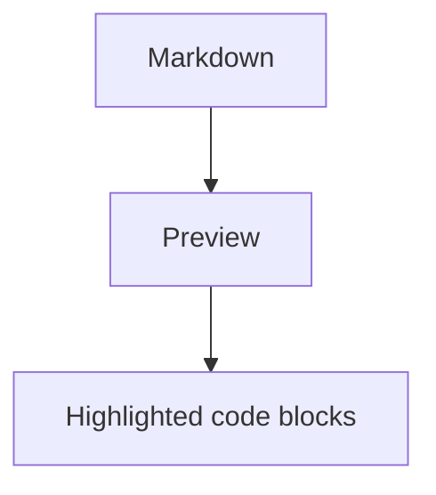

# Markdown Code Highlight Smoke

下面几个普通 fenced code block 应在 Markdown Preview 右侧显示语法着色。

```ts title="demo"
type User = {
  id: number;
  name: string;
};

const user: User = { id: 1, name: "Textora" };
```

```json
{
  "name": "textora",
  "preview": true
}
```

```bash
echo "hello textora"
```

未知语言应退化为普通已转义代码块：

```unknown
<script>alert("should not run")</script>
```

Mermaid fence 仍应优先渲染为图表，而不是代码高亮：


