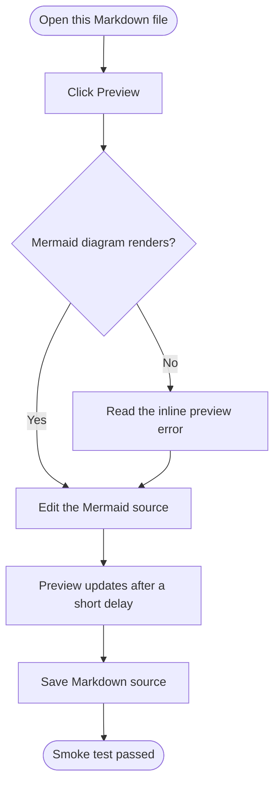

# Markdown Mermaid Preview Smoke Test

This Markdown file checks that Textora renders fenced Mermaid blocks inside the
Markdown preview while preserving the Markdown source as the saved content.



Regular code blocks should remain code blocks:

```ts
const preview = "Markdown code block";
```
