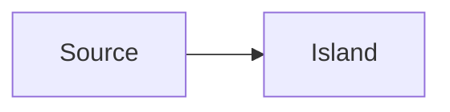

# WYSIWYG Smoke Test

Edit this paragraph in WYSIWYG mode.

- unordered item
- second item

1. ordered item
2. second ordered item

- [ ] pending task
- [x] completed task

> Edit this quote and verify the Markdown source updates.

```json
{"message":"edit me","count":1}
```

---

| Source island | Must survive |
| --- | --- |
| table | unchanged unless explicitly edited |



<section data-smoke="raw-html">Raw HTML source island</section>
